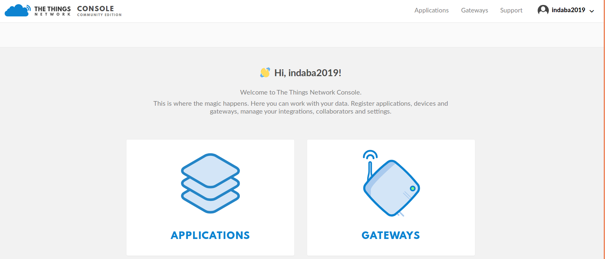
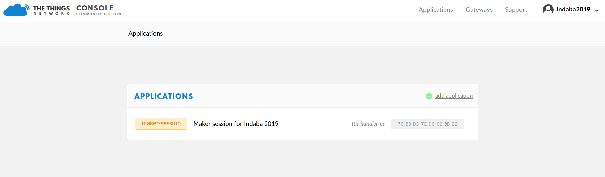

# Indaba Maker Session 2019

In this session we will develop software to collect data from a temperature sensor connected to the [NUCLEO F446RE](https://os.mbed.com/platforms/ST-Nucleo-F446RE/) board and deploy an application to visualise the data collected and perform predictions.

## Firmware Development
We will deploy two programs on the Nucleo board
1. The hardware hello world program *Blinky* that turns an LED on and off.
1. Temperature and humidity sensor

## Data Transmission

Data transmission from the sensors to the application will be via LoRaWAN. This is a long range low power sensor system ideal for the internet of things.

## Hardware requirements
1. NUCLEO-F446RE
1. LoRaWAN Transciever Shield (Custom made for DSA by ARM!)
1. USB Connector
1. Temperature sensor


## Set Up

Follow these instructions from DSA 2018 Nyeri by Jan Jongboon to set up. Refer to the original repo [here](https://github.com/janjongboom/dsa2018-greenhouse-monitor).

1. Sign up for an Mbed account [https://os.mbed.com](https://os.mbed.com).
1. Go to the [NUCLEO-F446RE](https://os.mbed.com/platforms/ST-Nucleo-F446RE/) platform page and click *Add to your Mbed compiler*.
1. Import the example program into the Arm Mbed Compiler by clicking [this link](https://os.mbed.com/compiler/#import:https://github.com/ciiram/indaba-maker-session-2019).
1. Click *Import*.
1. In the top right corner make sure you selected 'NUCLEO-F446RE'.

    

This has cloned the repository.

1. Click *Compile*.

    

1. A binary (.bin) file downloads, use drag-and-drop to copy the file to the NODE_F446RE device (like a USB mass storage device).

    **Note:** Here's a [video](https://youtu.be/L5TcmFFD0iw?t=1m25s).

1. When flashing is complete, hit the **RESET** button on the shield.


## Blinky
1. Open `select_program.h`.
1. Set:

    ```
    #define PROGRAM HELLO_WORLD
    ```
 1. Click *Compile*.

    

1. A binary (.bin) file downloads, use drag-and-drop to copy the file to the NODE_F446RE device (like a USB mass storage device).
1. When flashing is complete, hit the **RESET** button on the shield.
1. You should notice the led on the nucleo board flashing.
1. Open `hello_world.cpp` and change the value of the constant

   ```
   const float BLINK_PERIOD_S = 1;
   ```

   to a smaller or larger value and recompile the program and drag-and-drop the .bin to the Nucleo board. Confirm that the blinking rate has now changed.


## Temperature and humidity measurement
1. Let's connect up the hardware.
1. Connect red to AVDD, black to GND, yellow to D7.
   
1. On the online compiler, open `select_program.h`.
1. Set:

    ```
    #define PROGRAM TEST_TEMP
    ```
1. Click *Compile*.

    

1. A binary (.bin) file downloads, use drag-and-drop to copy the file to the NODE_F446RE device (like a USB mass storage device).
1. We need to view the program output with temperature and humidity values on the console. In linux we do the following

```
$ ls /dev/ttyACM*
/dev/ttyACM0
```

Then connect to the board using screen:

```
sudo screen /dev/ttyACM0 9600                # might not need sudo if set up lsusb rules properly
```
### Software to obtain console output
**Windows**

If you are on Windows, install:

1. [ST Link](http://janjongboom.com/downloads/st-link.zip) - serial driver for the board.
    * Run `dpinst_amd64` on 64-bits Windows, `dpinst_x86` on 32-bits Windows.
    * Afterwards, unplug your board and plug it back in.
    * (Not sure if it configured correctly? Look in 'Device Manager > Ports (COM & LPT)', should list as STLink Virtual COM Port.
1. [Tera term](https://osdn.net/projects/ttssh2/downloads/66361/teraterm-4.92.exe/) - to see debug messages from the board.

**Linux**

If you're on Linux, install:

1. screen - e.g. via `sudo apt install screen`

**MacOS**

Nothing required.


The output will look something like this
```
Temperature is 28.00 C
Humidity is 5.00
Temperature is 28.00 C
Humidity is 5.00
Temperature is 28.00 C
Humidity is 5.00

Err 6
```
Sometimes reading the sensor is unsuccessful and the error is reported.


## Data Transmission over LoRa

Follow these instructions from Jan's [repo](https://github.com/janjongboom/dsa2018-greenhouse-monitor)

### Grabbing credentials from The Things Network

We have a LoRaWAN network set up here but you need some credentials to connect to it. Let's grab some credentials from The Things Network.

1. Log in to the [The Things Network console](http://console.thethingsnetwork.org).

    

1. Use the following credentials:
    * Username: `dsa2018`.
    * Password: `dsa2018`.
1. Click *Applications*.
1. Click on `dsa2018-workshop`.

    

1. Click *Devices*.
1. Click *Register device*.

On the register device page:

1. First click the *generate* button below 'Device EUI'.

    

1. Enter a nice name for your device and click *Register*.

    

1. Click **Settings**.

    

1. Switch to **ABP**.

    

1. Disable (or uncheck) frame counter checks.

    

1. Click **Save**.


### Configuring your device
Get the device address, network session key and application session key.

1. Click the **Copy** button next to 'Device Address' to copy to clipboard.

    

1. Click the `< >` button of the **Network session key** and **Application session key** values to show the value as C-style array.
1. Click the **Copy** button on the right of the value to copy to clipboard.

Paste these keys into the file `device_addresses.h` in the appropriate sections:


* Put Device Address on the first line, prefixed with `0x`!
* Put Network Session Key on the second line, don't forget to add `;` at the end.
* Put Application Session Key on the third line, don't forget to add `;` at the end.

1. Connect the temperature sensor as you did earlier.
1. Connect the LoRa sheild on top of the Nucleo board.
1. The correct orientation of the LoRa shield is when all the logos are on the top.
1. On the online compiler, open `select_program.h`.
1. Set:

    ```
    #define PROGRAM TEMP_TRANSMIT
    ```
1. Compile, flash, ...
1. View the output on the console. You get something similar to
```
=========================================
      DSA 2018 Green House Monitor
=========================================
Sending every 20 seconds
[DBG ][LSTK]: Initializing MAC layer
[DBG ][LSTK]: Initiating ABP
[DBG ][LSTK]: Frame Counters. UpCnt=0, DownCnt=0
[DBG ][LSTK]: ABP Connection OK!
Connection - In Progress ...
Connection - Successful
Temp=23.000000 Humi=55.000000
Moist=0.000000
Sending 11 bytes
[INFO][LSTK]: RTS = 11 bytes, PEND = 0
[DBG ][LMAC]: Next Channel Idx=0, DR=4
[DBG ][LSTK]: Frame scheduled to TX..
11 bytes scheduled for transmission
```
1. You should see the data on the console also appear on TTN in your device under the data tab.


## Writing Data to a Database
TTN does not store data and for us to use the data in any application, we must store it in a database we configure ourselves. We will use an InfluxDB which is well suited to time series data.
We will use the [MQTT protocol](http://mqtt.org/) to transfer data from TTN to our database via a [python SDK](https://github.com/TheThingsNetwork/python-app-sdk) provided by TTN. We will write the data to a local InfluxDB on our machines which we will create.

1. Create a virtual environment
`python3 -m venv ttn`
1. Activate it
On Linux
`source ttn/bin/activate`
On Windows
`ttn\Scripts\activate.bat`
1. Install the python ttn sdk
`pip install 'ttn<3'`
1. Install InfluxDB
`pip install influxdb`
1. Run `ttn_example.py`

This should create an InfluxDB on your local machine named `indaba_session` and populate it with data whenever your device transmits data. It will also print out messages with the json of the uplink

```
Received uplink from  dev-01
{'time': '2019-08-13T09:44:17.171780715Z', 'fields': {'data_rate': 'SF12BW125', 'rssi': -103.0, 'snr': 4.2, 'Temperature': 19.0, 'Relative Humidity': 67.0}, 'measurement': 'Indaba Session', 'tags': {'sensor': 'dev-01'}}
```

These fields include temperature and humidity as well as radio transmission parameters.

1. Now we can examine the database. Install InfluxDB is shown [here](https://docs.influxdata.com/influxdb/v1.7/introduction/installation/)

1. Open the database

`influx -precision rfc3339 -database indaba_session`

1. Display the data collected so far
```
Connected to http://localhost:8086 version 1.7.4
InfluxDB shell version: 1.7.4
Enter an InfluxQL query
> SELECT * FROM "Indaba Session"
```

## Data Analysis
We will now get the data into a Jupyter notebook and perform some visualisation and analysis. We will work in the same virtual environment.

1. Install requirements
`pip install jupyter notebook`
`python -m pip install -U matplotlib`
`pip install pandas`
`pip install GPy`
1. Open the data analysis notebook and follow the instructions.
